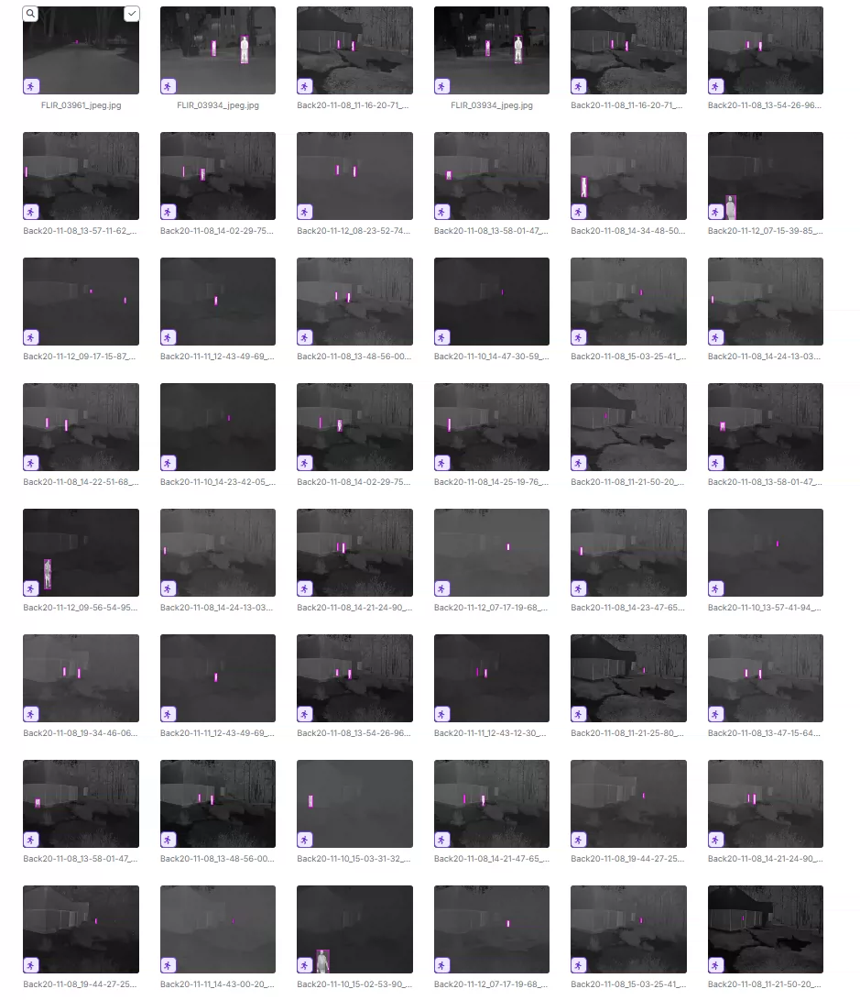
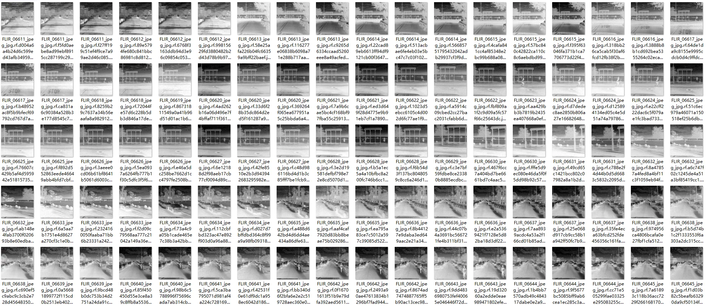
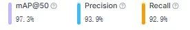
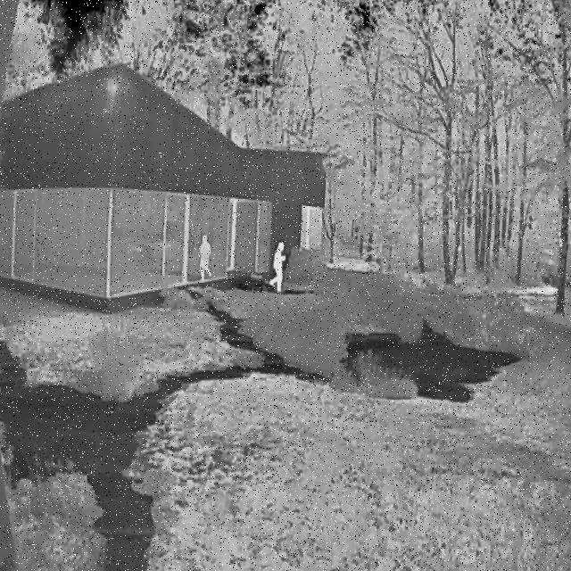
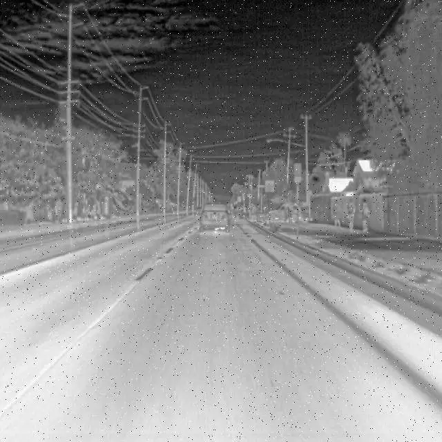
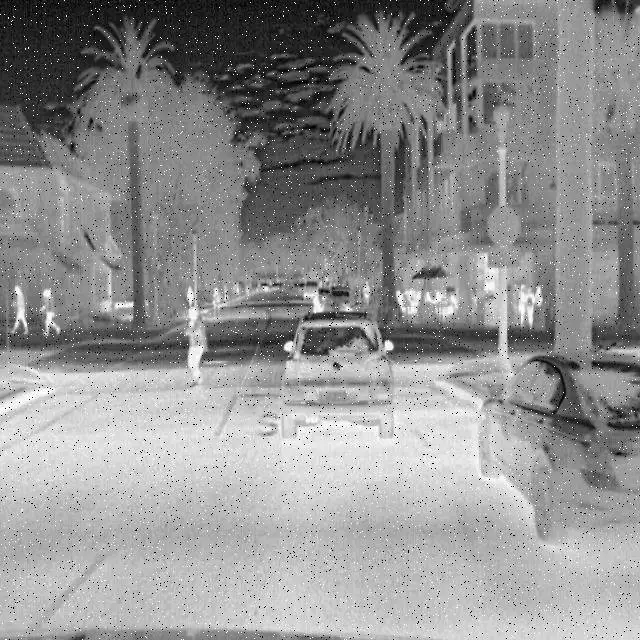
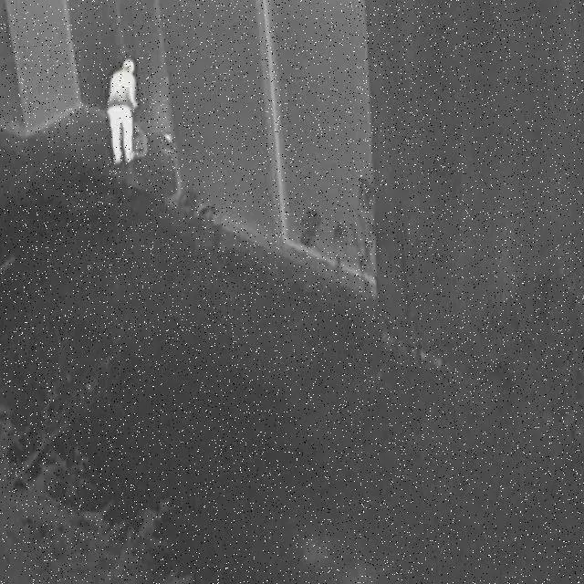

## Body

Infrared Human and Vehicle Target Detection Dataset in YOLO format

Totally 53,483 images are available, labeled with tags, and divided into training set, test set, validation set.

The dataset is divided into two categories: 'car' and 'person'.

Electronic virtual products sold without return or exchange.

## Images

item_1047857349992

Here is a pay link on Stripe ( https://buy.stripe.com/3cs8yP7sY87d0vu9AB ). Please contact me lonlonago@foxmail.com after funding $89, and I will send you a complete data files , thank you!

